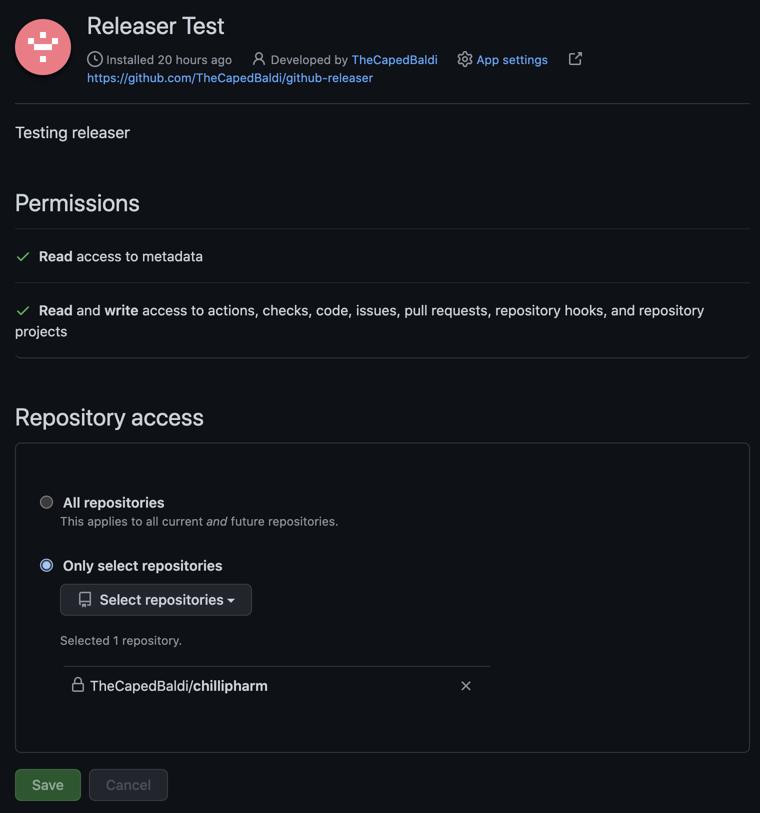

# github-releaser

This tool is designed to perform automated semver tagging of pull requests.
Therefore, this tool can be invoked through creating PRs.

## TL;DR

In order for this tool to accessible by Repositories, it is required that
the docker image is created and exposed in a public URL. See the `/Dockerfile`

### Docker

The docker image expects you to provide at least:
- `GITHUB_APP_ID`*
- `GITHUB_WEBHOOK_SECRET`*
- `GITHUB_PRIVATE_KEY`*
- `GITHUB_ENTERPRISE_URL` (optional)

Once running the container will expose the endpoint on port `8080` (or can be set by `HTTP_PORT`).
Once exposed, the webhook receiver URL (which is set in your Github App) needs to point towards the docker image.

### Github

This tool is only accessible via Github App, therefore, to install this app you will need to [**create a Github app**](https://docs.github.com/en/developers/apps/building-github-apps/creating-a-github-app) and assign it a *webhook url* which needs to point towards where the Docker image is exposed

#### 1. Permissions

When creating your Github app, make sure that the following [**permissions**](https://docs.github.com/en/developers/apps/building-github-apps/setting-permissions-for-github-apps) are ✅:

- `Contents`* (Read & Write)
- `Metadata`* (Read-only)
- `Pull Requests`* (Read & Write)

#### 2. Events

Also check that the following events are ✅:

- `Pull Request`*

## Local

It's highly encouraged that you test your changes before integrating your changes to this tool.

In order to install & use this tool locally, you are required to have the 
following setup before proceeding further:

1. **Github App** - You need to create Github App. Follow [**how to create Github app**](https://docs.github.com/en/developers/apps/building-github-apps/creating-a-github-app)
2. **Testing Repo** - You need a testing repo to test this tool
3. **Server** - Required to tunnel webhook URI. Either [localhost.run](https://localhost.run/) or [Cloudflare](https://developers.cloudflare.com/pages/how-to/preview-with-cloudflare-tunnel) will do fine

### Run

I'm using [**localhost.run to test the webhook URI**](https://andrewlock.net/using-ssh-and-localhost-run-to-test-github-webhooks-locally/), simply because no installation is required and is available by default in the mac terminal, but you're free to chose whichever you prefer.


To run the app locally, you need to ensure the following are running in parallel.

1. **Docker** - Either run the docker image, or simply do:
```sh
$ go build -a -installsuffix cgo -o main *.go &&& ./main
```

This will run the app on port 8080 by default.

2. **localhost.run** - To tunnel the webhook URI:
```
$ ssh -R 80:localhost:5000 localhost.run
```

3. **Trigger Webhook** - You can either trigger you  or create a testing PR in your testing Repo.

**Note:** If you want to test by creating PR in your testing repo, you first have to make sure that the app is installed and accessible by .

